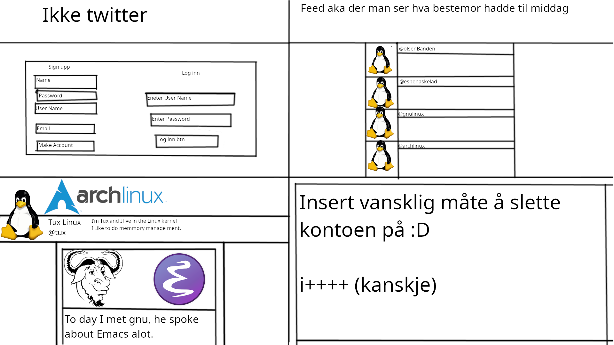

# notTwitter

# oppgave tekst

Er du lei av normale sosiale medier eller søker en utfordring når det gjelder læring?

Hva med å lage din egen versjon av Fjasboken?

Vanligvis så skal man kunne:

Opprette en bruker
Bruker skal kunne lagre og dele informasjon om seg selv til andre
Skal kunne ha venner og muligheten til å besøke andre profiler
Dele og slette sine egne innlegg samt kommentere andre sine innlegg
Ha en utrolig vanskelig prosess når det gjelder sletting av egen bruker
Forslag til start

Ta en titt på din eller en venn sin Facebook profil og tenk på hva som kunne gjort annerledes eller mer spennende.

Vær kreativ!

## bilde

## Oppgave liste

- [ ] Lage en log inn side (navn, epost, usrename)

- [ ] Lage en feed hovor man ser hva andre poster.

- [ ] Gjøre det mulig å kommentere på andre sine poster.

- [ ] Hver bruker har hver sin profil side.

- [ ] Ha bio, bilde, etc på profilen til brukeren.

- [ ] Legge til venner.

- [ ] Besøke andre sin profil/side.

- [ ] Dele innlegg/bilder, etc.

- [ ] Gjøre det grusomt vansklig å slette kontoen sin.

## Nice to have

- [ ] Liker/ikker liker knapp

- [ ] Makreds plass ?

- [ ] Noe annet ?
